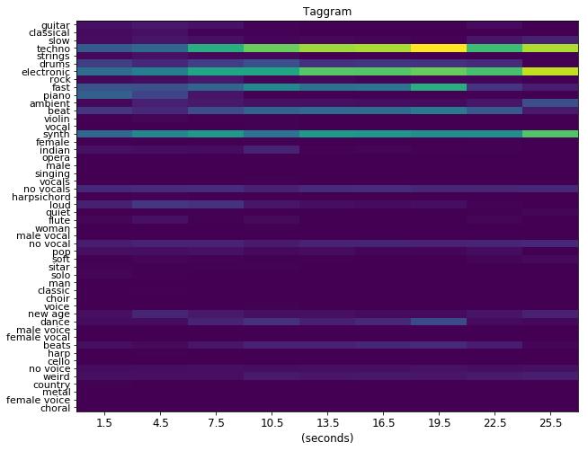

# musicnn
Pronounced as "musician", `musicnn` is a set of pre-trained musically motivated convolutional neural networks for music audio tagging. This repository also includes some pre-trained [vgg-like](https://github.com/jordipons/musicnn/blob/master/vgg_example.ipynb) baselines.

Check the [documentation](https://github.com/jordipons/musicnn/blob/master/DOCUMENTATION.md) and our [basic](https://github.com/jordipons/musicnn/blob/master/basic_example.ipynb) / [advanced](https://github.com/jordipons/musicnn/blob/master/musicnn_example.ipynb) examples for additional ideas on how to use `musicnn`.

Do you have questions? Check the [FAQs](https://github.com/jordipons/musicnn/blob/master/FAQs.md).

## Installation
```pip install musicnn```

or, to get all the documentation (including jupyter notebooks), install from source:

``` git clone https://github.com/jordipons/musicnn.git```

``` python setupy.py install```

## Predict tags

From within **python**, you can estimate the topN tags:
~~~~python
from musicnn.tagger import top_tags
top_tags('./audio/joram-moments_of_clarity-08-solipsism-59-88.mp3', model='MTT_musicnn', topN=10)
~~~~
>['techno', 'electronic', 'synth', 'fast', 'beat', 'drums', 'no vocals', 'no vocal', 'dance', 'ambient']

Let's try another song!

~~~~python
top_tags('./audio/TRWJAZW128F42760DD_test.mp3')
~~~~
>['guitar', 'piano', 'fast']

From the **command-line**, print to the topN tags on the screen:

~~~~
python -m musicnn.tagger file_name.ogg --print
python -m musicnn.tagger file_name.au --model 'MSD_musicnn_big' --topN 3 --length 3 --overlap 1.5 --print
~~~~~

or save to a file:

~~~~
python -m musicnn.tagger file_name.wav --save out.tags
python -m musicnn.tagger file_name.mp3 --model 'MSD_musicnn' --topN 10 --length 3 --overlap 1 --print --save out.tags
~~~~

## Extract the Taggram

You can also compute the taggram using **python** (see our [basic](https://github.com/jordipons/musicnn/blob/master/basic%20example.ipynb) example for more details on how to depict it):

~~~~python
from musicnn.extractor import extractor
taggram, tags = extractor('./audio/joram-moments_of_clarity-08-solipsism-59-88.mp3', model='MTT_musicnn')
~~~~


The above analyzed music clips are included in the `./audio/` folder of this repository. 

You can listen to those and evaluate `musicnn` yourself!
